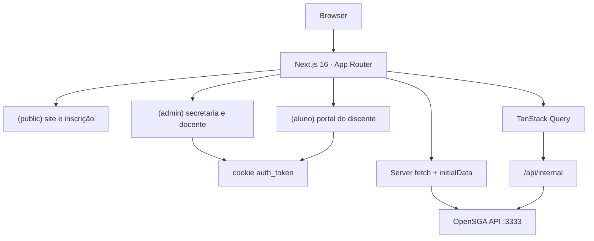

<div align="center">

# OpenSGA Frontend

Sistema de Gestão Acadêmica para IES brasileiras — projeto de estudo profissional.

Portal unificado: site institucional, inscrição pública, secretaria administrativa, espaço do docente e portal do aluno/responsável. Consome a [OpenSGA API](https://github.com/luizengdev/opensga-api).

[](https://nextjs.org/)
[](https://react.dev/)
[](https://www.typescriptlang.org/)
[](https://tailwindcss.com/)
[](https://ui.shadcn.com/)

[Documentação](#documentação) · [O que demonstra](#o-que-este-projeto-demonstra) · [Arquitetura](#arquitetura) · [Instalação](#instalação) · [Demo](#acesso-de-demonstração)

</div>

---

## Documentação

O contrato da API (Scalar / OpenAPI) é a fonte das rotas que este app consome:

| Ambiente | URL |
| :--- | :--- |
| Portal (local) | http://localhost:3000 |
| API / OpenAPI | http://localhost:3333/docs |

---

## O que este projeto demonstra

Estudo de um SGA no browser: três superfícies no mesmo App Router, sessão JWT em cookie e dados reais da API Fastify (sem mock de negócio).

| Decisão | Por quê importa |
| :--- | :--- |
| Route groups | Portal público, `/area-admin` e `/area-aluno` no mesmo app |
| Sessão no Server Component | Cookie `auth_token`; sem middleware de auth no estilo Express |
| Fetch no servidor + TanStack Query | `initialData` nas páginas; hooks em `@/lib/api/rc-generated` no client |
| Proxy `/api/internal` | O browser não fala com a API direto; o cookie vira `Authorization: Bearer` |
| Stripe só na API | Precificação e Checkout no Fastify; o front só redireciona a URL |

shadcn/ui (Base UI), React Hook Form, Zod 4 e `dayjs` cobrem formulários e datas.

---

## Arquitetura



Stack: **Next.js 16**, React 19, TypeScript, Tailwind CSS 4, shadcn/ui (`@base-ui/react`), TanStack Query, Zod 4.

O SDK Stripe **não** entra neste repositório. Catálogo, inscrição e Checkout passam pelos endpoints públicos da API.

---

## Instalação

**Requisitos:** Node.js **24.x**, npm, [OpenSGA API](https://github.com/luizengdev/opensga-api) em execução (`http://localhost:3333`).

```bash
git clone <url-do-repositorio> opensga-frontend && cd opensga-frontend
cp .env-example .env          # opcional; o default já aponta para :3333
npm install
npm run dev
```

| URL | Uso |
| :--- | :--- |
| http://localhost:3000 | portal institucional |
| http://localhost:3000/login-admin | secretaria e corpo docente |
| http://localhost:3000/login-aluno | portal do aluno |
| http://localhost:3000/inscricao | catálogo e inscrição pública |

Variáveis: [`.env-example`](./.env-example). `API_BASE_URL` (ou `NEXT_PUBLIC_API_URL`) é a origem da Fastify. Sem arquivo `.env`, o app usa `http://localhost:3333`.

---

## Acesso de demonstração

As contas vêm do seed da API (`npx prisma db seed --config prisma7.config.ts` no repositório da API).

| Papel | Onde entrar | Identificador | Senha |
| :--- | :--- | :--- | :--- |
| `ADMIN` | `/login-admin` | `testeadmin@opensga.dev` | `Admin@123456` |
| `PROFESSOR` | `/login-admin` | `professor@opensga.dev` | `Professor@123456` |
| `ALUNO` | `/login-aluno` | `aluno@opensga.dev` | `Aluno@123456` |

O seed monta `SEDE-REC` (campus presencial) e `POLO-EAD` (polo EAD), 10 cursos, matrizes 2026.1, turmas por curso, diários e faturas.

---

## Superfície do app

| Área | Rotas | Acesso |
| :--- | :--- | :--- |
| Institucional | `/`, `/inscricao`, `/inscricao/[cursoId]` | público |
| Auth | `/login-admin`, `/login-aluno` | público (redireciona se a sessão já vale) |
| Secretaria | `/area-admin/dashboard`, turmas, matrizes, disciplinas, cursos, campi, matrículas, usuários, preços, faturas, comunicados, ouvidoria | `ADMIN` |
| Docente | dashboard, turmas/diário, comunicados (leitura) | `PROFESSOR` |
| Aluno / responsável | `/area-aluno/dashboard`, notas, curso, matrícula, faturas, documentos, comunicados, ouvidoria, perfil | `ALUNO` / `RESPONSAVEL` |

O produto atual cobre o portal interno (`ADMIN` / `PROFESSOR`), a inscrição pública e o self-service do aluno/responsável via `GET /portal/contexto` (sem CRUD desses papéis no front).

---

## Licença

ISC. Projeto de estudo — não é homologação MEC.
