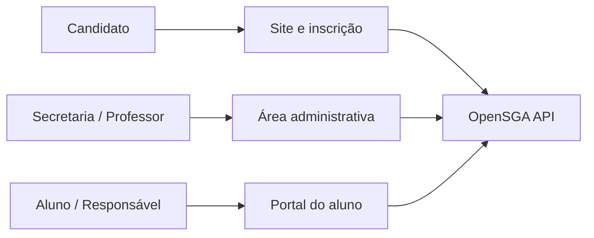

<div align="center">

# OpenSGA Frontend

Sistema de Gestão Acadêmica para universidades brasileiras.

Do vestibular à formatura: a secretaria opera o currículo, o professor lança o diário e o aluno acompanha a própria vida universitária — notas, faltas, mensalidade e documentos — no mesmo produto.

[](https://nextjs.org/)
[](https://react.dev/)
[](https://www.typescriptlang.org/)
[](https://tailwindcss.com/)
[](https://ui.shadcn.com/)
[](https://playwright.dev/)

[O produto](#o-produto) · [Portal do aluno](#portal-do-aluno-e-do-responsável) · [Regras acadêmicas](#regras-acadêmicas-que-o-produto-já-aplica) · [Demo](#como-ver-funcionando) · [Engenharia](#engenharia) · [Testes E2E](#testes-e2e-playwright)

**Demo em produção:** [opensga-frontend.vercel.app](https://opensga-frontend.vercel.app)

</div>

Este repositório é a interface web. As regras de negócio, o banco e o Stripe ficam na [OpenSGA API](https://github.com/luizengdev/opensga-api). Projeto de estudo profissional — **não é homologação MEC**.

---

## O produto

Instituição de ensino superior precisa de uma fonte única para:

1. **Matricular** o aluno no curso certo, com RA único e matriz curricular vigente.
2. **Ofertar turmas** no campus presencial ou no polo EAD, respeitando a modalidade.
3. **Avaliar** com o regulamento brasileiro (AV, prova substitutiva, recuperação final e teto de faltas).
4. **Cobrar** a mensalidade e conciliar o pagamento.
5. **Entregar transparência** ao estudante e à família, sem fila na secretaria para consulta de rotina.

O OpenSGA cobre essa jornada em um único app: site institucional, inscrição pública, secretaria, diário do professor e portal do aluno/responsável.

| Quem                 | Entra em           | O que consegue fazer                                                                                                                                            |
| :------------------- | :----------------- | :-------------------------------------------------------------------------------------------------------------------------------------------------------------- |
| Candidato            | `/` e `/inscricao` | Ver o catálogo, escolher o curso e pagar a 1ª parcela (cartão ou boleto). Isenção não abre Checkout.                                                            |
| Secretaria (`ADMIN`) | `/login-admin`     | Campus e polos, cursos, matrizes, turmas, matrículas, consulta acadêmica, transferência interna, preços, faturas, comunicados, ouvidoria e modelos de certidão. |
| Professor            | `/login-admin`     | Lançar AV, AVS, AV3 e faltas nas turmas em que é titular; fechar o semestre.                                                                                    |
| Aluno                | `/login-aluno`     | Ver matrícula, matriz, boletim, faturas, documentos, comunicados, ouvidoria e trocar a senha.                                                                   |
| Responsável          | `/login-aluno`     | O mesmo recorte do dependente vinculado (guarda acadêmica e financeira).                                                                                        |

---

## Portal do aluno e do responsável

Autoatendimento do vínculo. O aluno **não** monta grade nem altera CPF: cadastro e currículo continuam na Secretaria. O que aparece na tela vem da API — sem número inventado.

| Tela                   | Para que serve                                                                                                                                                                                                                |
| :--------------------- | :---------------------------------------------------------------------------------------------------------------------------------------------------------------------------------------------------------------------------- |
| **Início**             | Foto do semestre: avisos, pendências de nota ou fatura, atalhos.                                                                                                                                                              |
| **Minha matrícula**    | RA, curso, campus/polo, status do vínculo e disciplinas em que está enturmado **neste** período letivo (ex.: 2026.2). Declaração de matrícula quando o status for Ativo.                                                      |
| **Meu curso**          | Quanto da matriz já foi integralizado (carga horária cumprida / carga do curso) e o histórico por semestre, com média final quando existir.                                                                                   |
| **Notas e frequência** | Boletim: AV, AVS, **NS = a maior das duas**, AV3, faltas versus o limite da disciplina e a situação **oficial** (Em aberto, Aprovado, RF ou RN). Resultado conclusivo só depois que o professor/secretaria **fecha** a turma. |
| **Faturas**            | Mensalidades, vencimento e pagamento. Só redireciona ao Stripe se houver valor e link; fatura R$ 0 não abre Checkout. Recibo quando paga.                                                                                     |
| **Documentos**         | Declaração, histórico parcial, quitação e carteirinha — só os modelos que a Secretaria deixou ativos. Impressão no navegador, com código autenticador.                                                                        |
| **Comunicados**        | Mural da IES filtrado para aluno ou responsável.                                                                                                                                                                              |
| **Ouvidoria**          | Abrir e acompanhar **o próprio** protocolo (financeiro, pedagógico, secretaria, infraestrutura ou ouvidoria geral).                                                                                                           |
| **Perfil**             | Nome, e-mail, CPF e RA em leitura. Troca da senha provisória do e-mail de matrícula. Dado civil (nome social, endereço) se resolve no polo, com documento original.                                                           |

O calendário na tela (`2026.1` / `2026.2`) é o **período institucional**. O “3º período” do aluno é outra coisa: é o semestre do curso na matriz.

---

## Regras acadêmicas que o produto já aplica

O valor educacional não está no layout: está no motor que o front apenas exibe.

| Regra                                 | O que o gestor e o aluno veem                                                                                                                   |
| :------------------------------------ | :---------------------------------------------------------------------------------------------------------------------------------------------- |
| Frequência soberana                   | Faltas acima do percentual da carga horária (padrão 25%) geram **RF** e zeramento de CH, independentemente da nota.                             |
| Nota semestral                        | **NS = MAX(AV, AVS)** — nulos ignorados. Sem “A1/A2/AF”.                                                                                        |
| Aprovação direta                      | No **fechamento** da turma: NS ≥ corte (padrão 6,0) e frequência regular → Aprovado e CH no histórico.                                          |
| Recuperação (AV3)                     | NS abaixo do corte e presença regular → AV3; média final = (NS + AV3) / 2 (padrão ≥ 5,0).                                                       |
| Extensão (CNE/CES 7/2018)             | A matriz precisa de pelo menos 10% de carga de extensão. A secretaria audita isso no dashboard.                                                 |
| Multimodalidade (Decreto 12.456/2026) | Presencial, semipresencial e EAD têm pisos de carga presencial/síncrona/assíncrona por disciplina.                                              |
| Campus × polo                         | Sede presencial não oferta EAD; polo EAD só oferta EAD.                                                                                         |
| Mensalidade                           | O preço vive no OpenSGA; o Stripe só cobra. Matrícula só vira Ativo quando o pagamento confirma (cartão na hora, boleto depois da compensação). |

Cortes de nota e limite de faltas são parametrizáveis pela Secretaria (`/area-admin/parametrizacoes`). O boletim do aluno usa esses valores e a situação gravada no diário — **não simula** um fechamento que ainda não aconteceu.

Documento de negócio: [BRD](https://github.com/luizengdev/opensga-api/blob/develop/docs/brd.md) · critérios de aceite: [QA](https://github.com/luizengdev/opensga-api/blob/develop/docs/qa-arquitetura-testes.md).

---

## Como ver funcionando

Suba a [API](https://github.com/luizengdev/opensga-api) (`npx prisma db seed --config prisma7.config.ts`) e este app (`npm run dev`).

| Papel              | URL            | Identificador             | Senha              | O que observar                                                      |
| :----------------- | :------------- | :------------------------ | :----------------- | :------------------------------------------------------------------ |
| Secretaria         | `/login-admin` | `testeadmin@opensga.dev`  | `Admin@123456`     | KPIs, ocupação por campus, extensão, matrículas, consulta acadêmica |
| Professor          | `/login-admin` | `professor@opensga.dev`   | `Professor@123456` | Diário da turma, lançamento AV/AVS                                  |
| Aluno (1º período) | `/login-aluno` | `aluno@opensga.dev`       | `Aluno@123456`     | Matrícula, boletim em aberto, fatura pendente                       |
| Aluno (4º período) | `/login-aluno` | `aluno.esw.4@opensga.dev` | `Aluno@123456`     | Histórico 1–3 já aprovado e turmas do 4º em andamento               |

O seed monta a sede Recife (presencial) e um polo EAD, cursos com matriz 2026.1 (extensão ≥ 10%), turmas, diários e faturas.

| URL                             | Uso                     |
| :------------------------------ | :---------------------- |
| http://localhost:3000           | site institucional      |
| http://localhost:3000/inscricao | catálogo e inscrição    |
| http://localhost:3333/docs      | contrato OpenAPI da API |

---

## Engenharia

Três superfícies no mesmo Next.js (App Router). A sessão é um JWT no cookie `auth_token`. O browser não chama a API direto: o servidor e o proxy `/api/internal` acrescentam o Bearer. Stripe, e-mail e PostgreSQL ficam só na API.



| Decisão                                         | Por quê                                                  |
| :---------------------------------------------- | :------------------------------------------------------- |
| Route groups `(public)` / `(admin)` / `(aluno)` | Três portais, um deploy                                  |
| Sessão no Server Component                      | Sem middleware estilo Express; o cookie é lido na página |
| Fetch no servidor + TanStack Query              | Primeira pintura com dados reais; o client revalida      |
| Sem SDK Stripe no front                         | O aluno só segue a URL de Checkout que a API devolve     |

Stack: **Next.js 16**, React 19, TypeScript, Tailwind CSS 4, shadcn/ui, TanStack Query, Zod 4, `dayjs`.

### Instalação

**Requisitos:** Node.js **24.x**, npm, API em `http://localhost:3333`.

```bash
git clone <url-do-repositorio> opensga-frontend && cd opensga-frontend
cp .env-example .env
npm install
npm run dev
```

Variáveis em [`.env-example`](./.env-example). Sem `.env`, o app usa `http://localhost:3333`.

Na secretaria, **Matrículas & RA** agrupa Alterar Situação e Consulta Acadêmica (busca por RA, nome ou CPF). A sidebar admin tem largura arrastável.

---

## Testes E2E (Playwright)

A suíte em `e2e/` cobre os cenários **P0** do [documento de QA](https://github.com/luizengdev/opensga-api/blob/develop/docs/qa-arquitetura-testes.md) (IDs `QA-*`): login unificado, RBAC do professor, dashboards, turmas/diário, lançamento AV/AVS/AV3, fechamento, enturmação, auditoria MEC e jornada ponta a ponta.

Os testes sobem um **mock HTTP** da API (`e2e/mocks/mock-api-server.mjs` na porta `3334`) e o Next em `http://localhost:3000` — não dependem da API real nem do Postgres. Locators semânticos (role/texto), Page Objects em `e2e/pages/`, fixtures em `e2e/fixtures/`, reporter **Allure** e workflow GitHub Actions com sharding.

### Rodar localmente

Na primeira vez, instale o Chromium do Playwright:

```bash
npx playwright install chromium
```

```bash
# Suite completa (build + testes; CI=true evita reutilizar servidor já aberto)
CI=true npm run test:e2e

# Sem rebuild (já existe .next/)
CI=true npx playwright test --reporter=list --retries=0

# UI Mode / headed / contra next dev
npm run test:e2e:ui
npm run test:e2e:headed
npm run test:e2e:dev
```

Se as portas `3000` ou `3334` estiverem ocupadas: `fuser -k 3000/tcp 3334/tcp`.

### Relatórios

```bash
# HTML do Playwright
npm run test:e2e:report

# Allure (após uma run que gerou allure-results/)
npx allure generate allure-results --clean -o allure-report
npx allure open allure-report
# ou: npx allure serve allure-results
```

<!-- Cole aqui prints ou GIFs da suíte verde, do HTML report e do Allure -->

### CI

O workflow [`.github/workflows/e2e.yml`](./.github/workflows/e2e.yml) roda em push/PR: `npm ci` → build → Playwright em **2 shards** → upload de `playwright-report/`, `test-results/` e `allure-results/` como artifacts.

---

## Licença

ISC. Projeto de estudo — não substitui sistema acadêmico homologado nem ato regulatório do MEC.
